# Andy

Andy is a desktop companion for Android developers.

## Download

[Download the latest release](https://github.com/j-roskopf/Andy/releases/latest)

### Runtime Requirements

- Android SDK platform tools for device and emulator access.
- mitmproxy for Network capture and rewrite rules: `brew install mitmproxy`.
- scrcpy does not need to be installed separately for embedded mirroring; Andy bundles `scrcpy-server`.

## Features

### Devices

Discover connected Android devices and created emulators in one place. Search and filter by device type or API level, start emulators, jump into a live session, and stop running emulators without leaving Andy.

### Virtual Device Creation

Create new Android Virtual Devices from SDK profiles and system images. Andy can install the selected image, configure orientation, RAM, storage, CPU, GPU, locale, cameras, hardware keyboard, and optionally launch the emulator after creation.

### System Image Catalog

Browse installed and available Android emulator system images. Filter by API, variant, or ABI, download missing images, and remove unused installed images when no AVD depends on them.

### Snapshots

Save, restore, and delete emulator snapshots for any created AVD. This makes it quick to return a test device to a known state before reproducing bugs or validating flows.

### Live Mirror

Stream a selected device or emulator into Andy with an embedded H.264 mirror. Send touch, keyboard, navigation, power, volume, rotation, screenshot, and text input commands directly from the desktop UI.

### Pop-Out Mirror

Open the device mirror in a separate focused window. The pop-out keeps the same input and hardware controls available when you want to watch or drive the device beside the main workspace.

### Apps

Inspect installed packages on the selected device. Launch, stop, clear data, reset permissions, uninstall user apps, and review declared permissions and activities from a split app/details view.

### Logcat

Stream device logs with live pause, clear, search, package filtering, and per-level toggles. The main Logcat screen includes resizable columns, while Live keeps a compact log panel next to the mirror.

### Intents

Build and send Android activity, deep link, service, and broadcast intents. Andy shows the generated `am` command before sending it so you can verify the exact action, component, and data URI.

### Files & Data

Browse device file paths such as `/sdcard`, `/data/local/tmp`, and `/storage/emulated/0`. Navigate directories, inspect mode, size, and modified timestamps, and use the file service for pull, push, and delete workflows.

### Network

Run a debug-app HTTPS proxy backed by mitmproxy. Start and stop capture, configure device proxy routing, install the local CA, inspect request and response headers or bodies, and organize traffic by host and path.

### Proxy Rules

Create ordered network rewrite rules that match URL patterns and optional HTTP methods. Rules can change status codes, set or remove headers, and provide response bodies for debug-app testing.

### Controls

Toggle common device state without memorizing `adb shell` commands. Andy includes controls for airplane mode, Wi-Fi, mobile data, Bluetooth, dark mode, font scale, animation scale, show taps, pointer location, layout bounds, and hardware buttons.

### Performance

Monitor device performance samples over time. Andy displays CPU, memory, frame rendering, battery, process metrics, and frame timing bars that make slower-than-60-fps frames stand out.

### Design

Overlay design tools on top of the live device mirror. Use a grid, ruler, zoom controls, configurable overlay colors, and a pointer color picker to inspect spacing and visual details while interacting with the app.

### Accessibility

Dump and inspect the Android accessibility hierarchy beside the live mirror. Hover or select nodes to highlight bounds, filter to interesting nodes, toggle layout bounds, and review labels, state, geometry, and simple accessibility issues.

### Bug Capture

Capture reproducible bug reports from Live. Andy saves recent actions, live video frames, logcat, device metadata, and notes, then lets you replay, scrub, export, or delete reports from the Bugs screen.

### Updates

Check for desktop app updates and confirm installation from inside Andy. Version metadata is generated at build time and the app can surface a close-and-install prompt when an update is ready.

## Screenshots

| Create AVD | Live Mirror | Devices |
| --- | --- | --- |
| 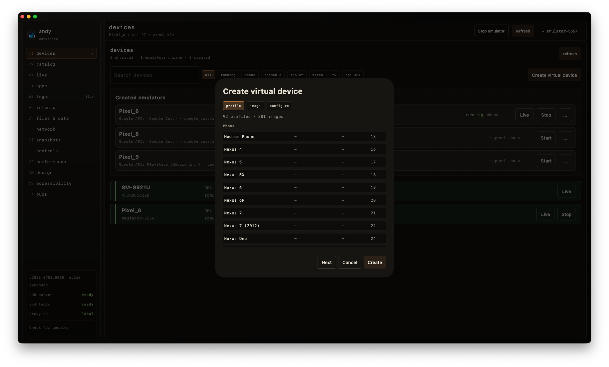 | 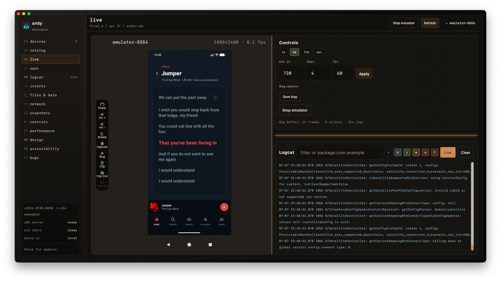 | 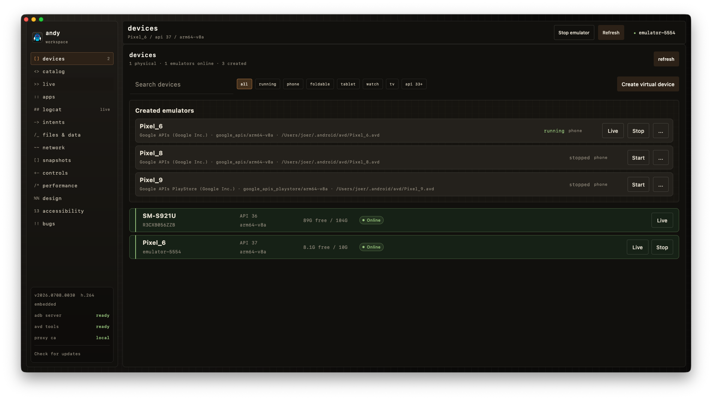 |
| Catalog | Apps | Logcat |
| 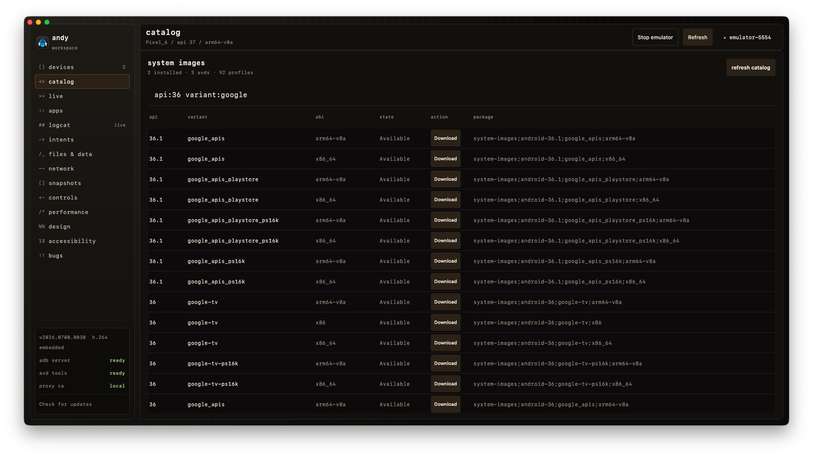 | 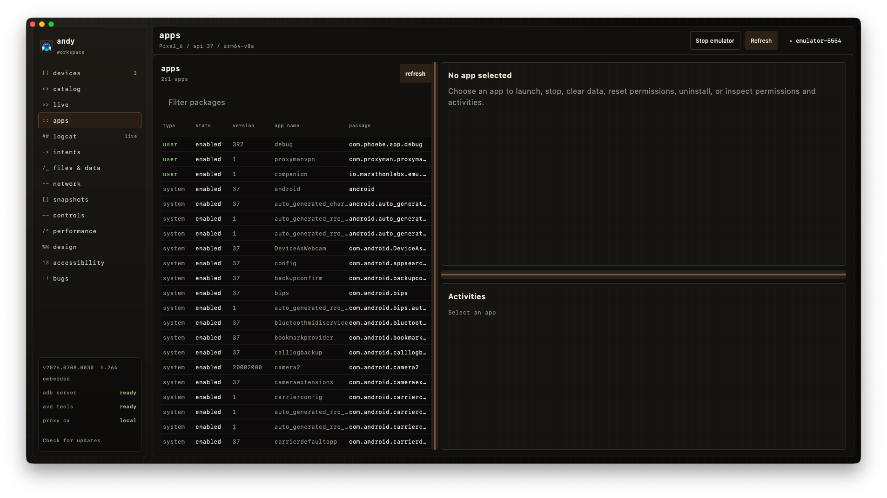 | 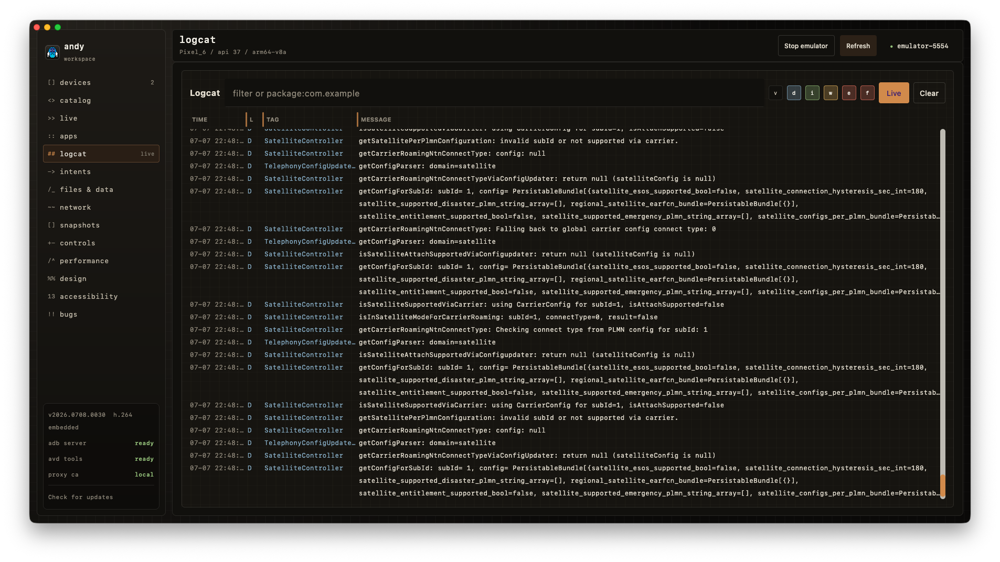 |
| Intents | Files & Data | Network |
| 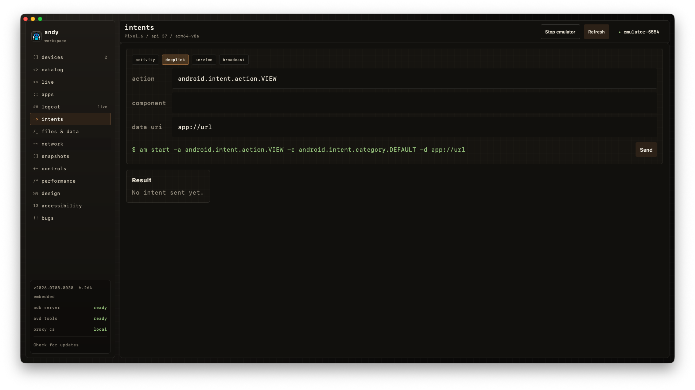 | 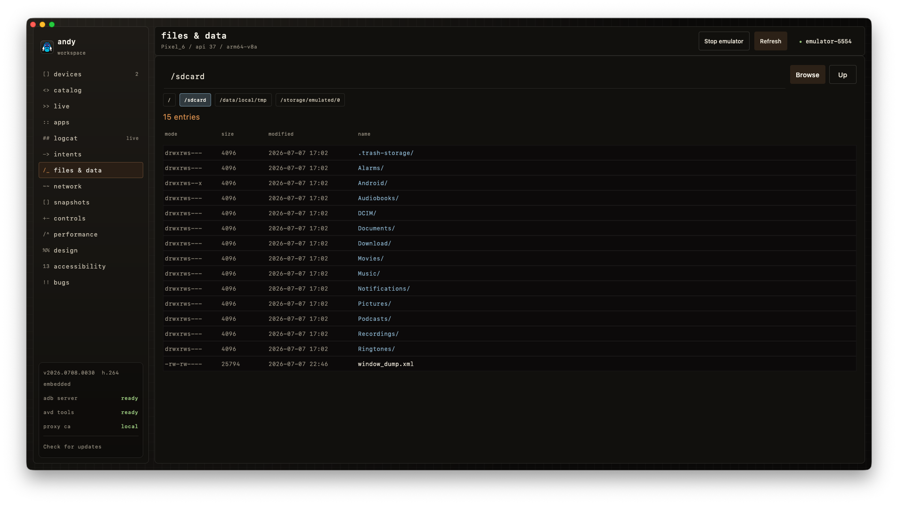 | 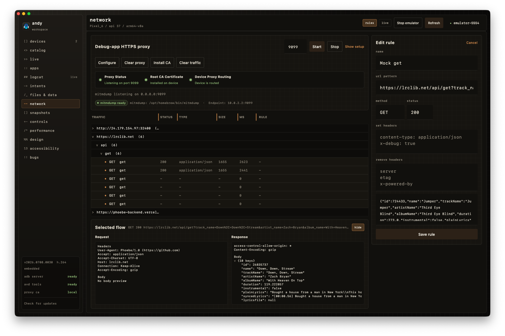 |
| Snapshots | Controls | Performance |
| 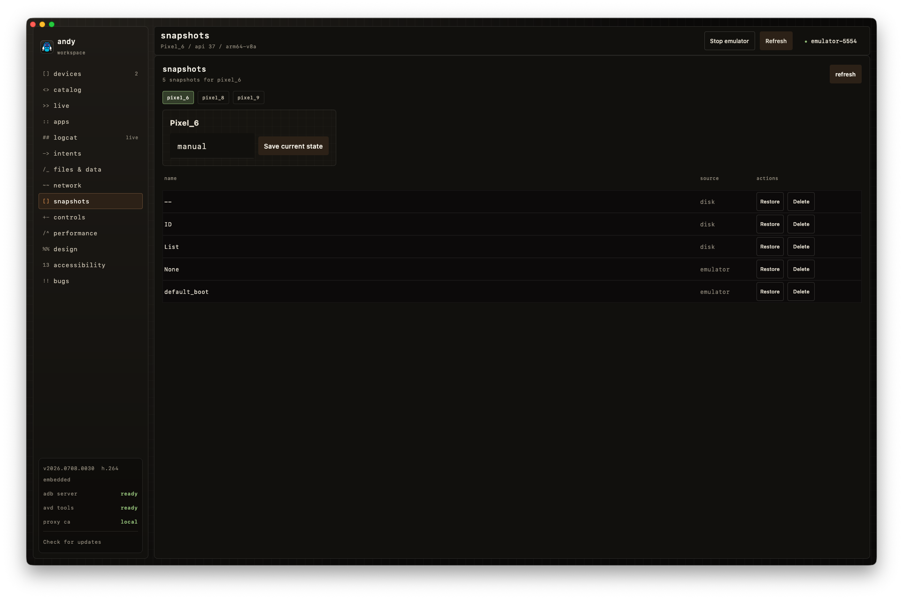 | 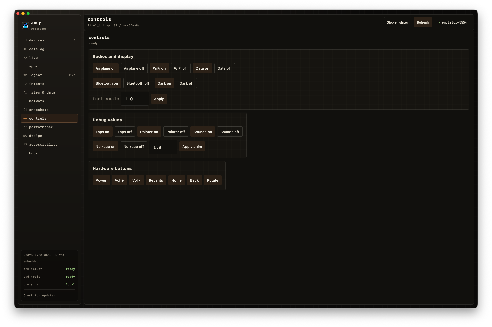 | 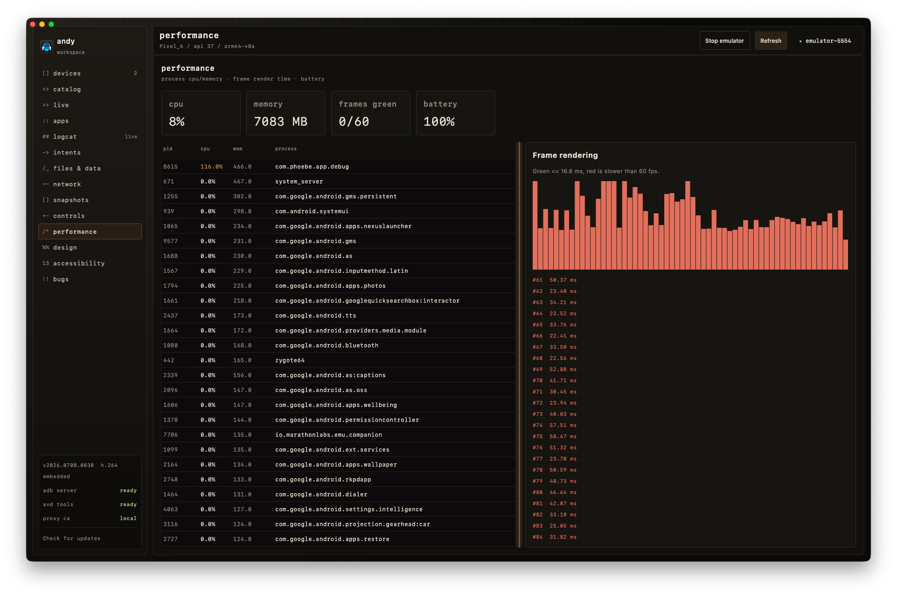 |
| Design | Accessibility | Bug Capture |
| 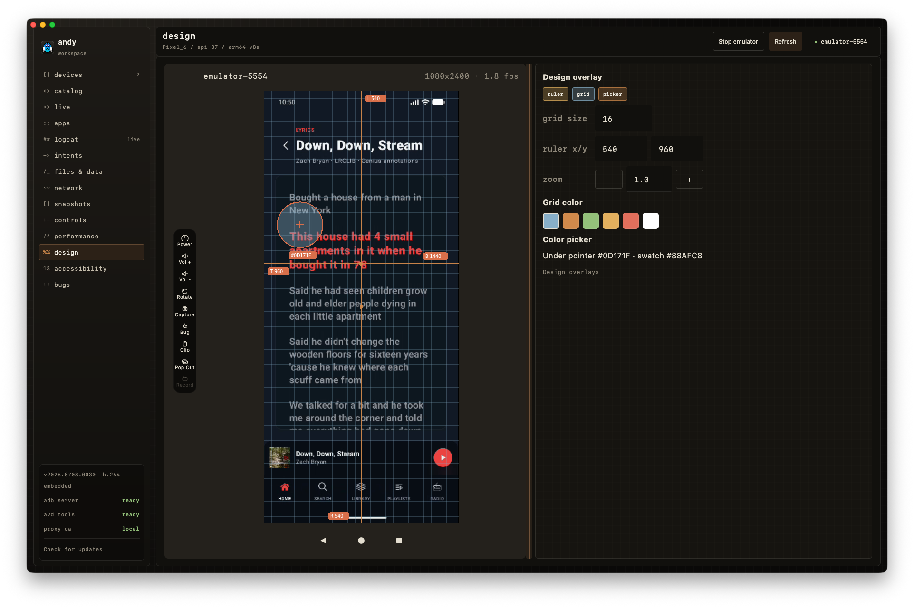 | 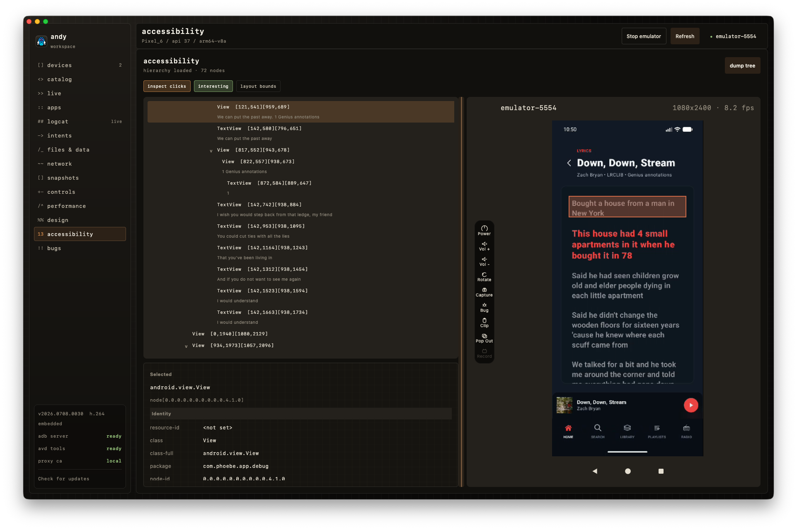 | 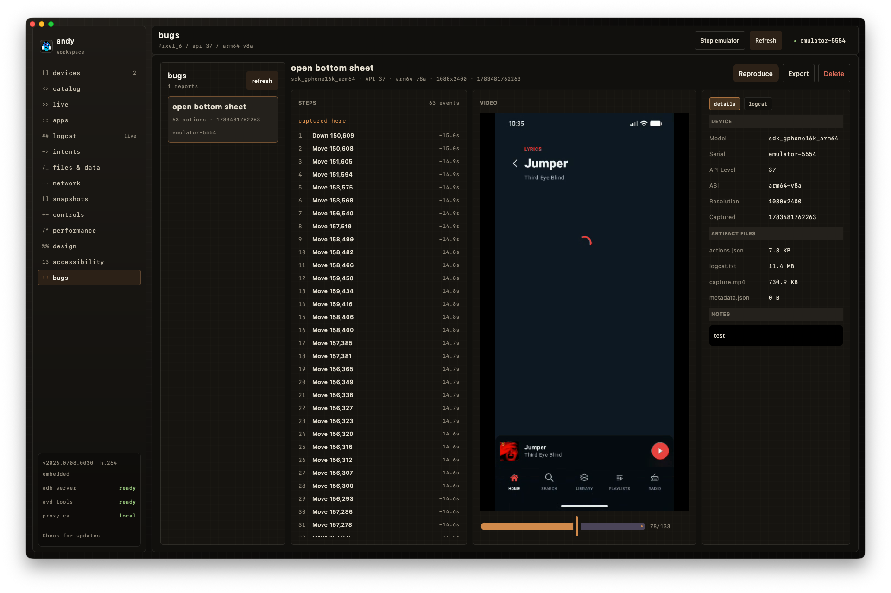 |
