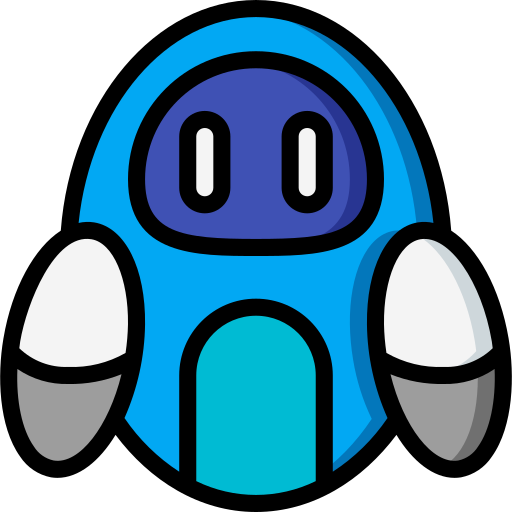

<p align="center">
  
</p>

# Andy

[](https://androidweekly.net/issues/issue-736)
[](https://jetc.dev/issues/323.html)
[](https://mailchi.mp/kotlinweekly/kotlin-weekly-521)

**A workspace for coding agents that keeps mobile work close.**

Andy is a local-first desktop app for people who build software using coding agents from multiple providers, with a strong focus on mobile. You run agents next to devices, projects, and tools. You can also drive the same work from a phone, a terminal, or web.

[Download](https://github.com/j-roskopf/Andy/releases/latest)
·
[Web](https://andy.joetr.com)
·
[Daemon and CLI](docs/ANDYD.md)
·
[Android companion](docs/ANDROID_MOBILE.md)

## How the pieces fit

| Layer | Role |
| --- | --- |
| **Desktop app** | Full workspace. Agents, projects, devices, mirror, and debug tools. |
| **`andyd` daemon** | Shared control plane for agent and project state. Serves MCP. |
| **CLI (`andy`)** | Terminal client for chats, devices, and automation (macOS and Linux). |
| **Android companion** | Phone client for host screen control and project chats. |
| **Network Access web** | Small chat page for ACP chats from other devices on your network. |
| **Andy for web** | Browser subset for device work through WebUSB or Tracebox. |

> Andy puts coding agents in one place with mobile tools. The desktop app has the full set. The phone, CLI, and web clients connect to the same work when you need them away from the desk.

## Capabilities

### 1. Projects as agent workspaces

A project is a repo path plus context. Each project has tabs for chats, tasks, artifacts, automations, kanban, runbook actions, a markdown scratchpad, and nested git worktrees.

- Start agent chats that inherit project context.
- Keep per-project agent profiles (provider, model, autonomy).
- Run shell actions in a docked Terminal.
- Set optional environment variables per project.

**Workflows (desktop).** Drive Spec → Build ↔ Review ↔ Verification from the tasks tab. Create or refine specs. Open plan snapshots into builds. Gate review verdicts. Track verification criteria and attempt history. Jump into related agent runs.

**Artifacts (desktop).** Browse Media and Documents for workflow outputs, uploads, and pinned files. Preview text. Reveal files on disk. Pin or unpin entries. An unscoped Agents catalog collects artifacts that are not tied to a project.

**Automations (desktop).** Schedule recurring agent work with once, hourly, daily, weekday, weekly, interval, or cron schedules. Choose standalone, dedicated-thread, or heartbeat mode. Set failure policy, max iterations, and notifications. Arm with Resume, run by hand, or drive from MCP `automation.*` tools while `andyd` is up.

**Kanban (desktop).** Track work on a drag-and-drop board. Andy starts with To-Do, Doing, and Done lanes. Add, rename, reorder, or delete lanes. Create cards with a title, description, and tags. Assign cards to agent chats. Start a spec from a card. The board is local to Andy Desktop. It is not available when Andy Desktop uses `andyd` (local or remote). Quit `andyd` and restart Andy to edit the board.

When Andy Desktop uses `andyd`, scratchpad and profile writes do not save through the client. Creating a build pair over that client is not wired yet.

### 2. Coding agents

Dispatch tasks to Claude Code, Codex, Cursor, Antigravity, OpenCode, Pi, Hermes, OpenClaw, Goose, or local Ollama / LM Studio backends (through OpenCode, Pi, or Goose).

- Compose prompts with images, `@file` mentions, and `/` skills.
- Choose model, autonomy, and provider sandbox or approvals.
- Isolate a run in a git worktree when you need a clean boundary.
- Toggle plan mode. Set a persistent `/goal` for Codex and Claude Code.
- Import a vendor thread or session id to resume an existing conversation.
- Attach Andy MCP so the agent can drive Android and iOS targets ([device tools](#10-mcp-for-device-control)).
- Start temporary chats that do not persist. Promote them when ready.
- Open side chats for a read-only second opinion.
- Pin priority chats at the top of project and agent inboxes.
- Follow the live transcript (thinking, tools, images, mermaid, cost and tokens).
- Review file diffs when a task ends. Open file links in Andy's code viewer.
- Send or queue follow-ups. Archive chats or mark them unread.
- Check provider quota from the inbox. Use voice dictation when enabled in Settings.

**Andy slash commands.** Type `/` in the composer. Andy shows native commands, provider commands, and installed skills. Andy installs these orchestration skills for you:

| Command | What it does |
| --- | --- |
| `/goal <text>` | Sets a persistent goal for this task (Codex and Claude Code). Use `/goal clear` to remove it. |
| `/andy-handoff …` | Gives the task to a new agent with a full briefing. |
| `/andy-loop …` | Runs a worker and a verifier until the goal is done or a limit stops the loop. |
| `/andy-advisor …` | Starts one read-only advisor for a second opinion. |
| `/andy-committee …` | Starts two advisors to plan root cause and review. |

Orchestration commands need Andy MCP on the chat. Select one of these skills in the new-task composer to attach MCP. Set default providers in Settings → Agents → Orchestration.

### 3. Mobile-first device work

Android is the primary platform. On macOS, Andy also covers day-to-day iOS Simulator work.

**Devices.** Discover connected Android devices and created emulators. Search and filter by type or API level. Start or stop emulators. Jump into a live session. Pair physical devices over Wi‑Fi from a QR or pairing dialog. Save pairs, reconnect, or forget them without USB. Set a custom label on each device.

**Virtual devices and catalog.** Create AVDs from SDK profiles and system images. Set orientation, RAM, storage, CPU, GPU, locale, cameras, and keyboard. Browse installed and available system images. Download or remove images when no AVD depends on them.

**Snapshots.** Save, restore, and delete emulator snapshots so you can return a test device to a known state.

**Live mirror.** Stream an Android device or emulator with an embedded H.264 mirror. Send touch, keyboard, navigation, power, volume, rotation, screenshot, and text. Record into the Recordings library. Annotate screenshots with redaction, shapes, text, and an optional device frame. Drag an APK onto the mirror to install it. Tune size, bitrate, FPS, and renderer. Split Live into panes so you can mirror several targets at once. Dock Live, Logcat, Terminal, or Browser beside or below the main content. Pop the mirror into a focused window when you want it alone.

**iOS on macOS.** Manage Simulators (create, boot, clone, erase, rename, delete). Mirror a booted Simulator with touch. Browse apps and sandbox files, Prefs, and SQLite. Tail `simctl log stream`. Drive URL-scheme intents. Use Simulator controls for appearance, Dynamic Type, status bar, location, privacy, clipboard, and push notifications. List crash reports and try `atos` symbolication when a matching `.dSYM` is available. Physical iOS devices support USB Live mirror plus apps, file copy, and crash management when Developer Mode is on. Input stays simulator-only. MCP and `andy` expose the same hybrid surface: shared device tools accept Android serials or iOS UDIDs, with `andy ios …` for simulator lifecycle and Controls.

### 4. Debug and inspection tools

| Surface | What you can do |
| --- | --- |
| **Apps** | Launch, stop, clear data, reset permissions, uninstall, review permissions and activities. |
| **Logcat** | Stream logs with pause, clear, search, package filter, and level toggles. Group stack traces. Deobfuscate with R8 / ProGuard `mapping.txt`. Browse dropbox crashes and ANRs. |
| **Intents** | Build and send activity, deep link, service, and broadcast intents. See the `am` command before you send it. |
| **Files** | Browse device paths. Pull, push, and delete. |
| **Shared Preferences** | Inspect and edit `shared_prefs` for a debuggable package. |
| **App Databases** | Browse and edit SQLite for a debuggable app. Run or save SQL. Pull a copy to the host. |
| **Network** | Run a debug-app HTTPS proxy with mitmproxy. Inspect headers and bodies. Organize by host and path. |
| **Proxy rules** | Match URL patterns and methods. Change status, headers, or response bodies. |
| **Controls** | Toggle airplane mode, Wi‑Fi, data, Bluetooth, dark mode, font scale, animation scale, taps, pointer, layout bounds, TalkBack, and more. Emulator extras cover GPS routes, sensors, GSM, thermal, hinge posture, battery, and locale. |
| **Performance** | Sample CPU, memory, frames, battery, thermal, and process metrics. Capture heap dumps and batterystats summaries. |
| **Tracing** | Capture Perfetto traces with presets. Keep a local library. Open traces in the Perfetto UI. |
| **Design** | Overlay grid, ruler, zoom, colors, and an optional image on the live mirror. |
| **Accessibility** | Dump and inspect the accessibility hierarchy beside the mirror. |
| **Inspector** | Capture the on-screen view hierarchy, properties, 2.5D layers, and structural diffs. No on-device agent required. |
| **Bugs** | Capture actions, video frames, logcat, metadata, and notes. Replay, scrub, export, or delete. Use Explain… to start a read-only agent chat with selected evidence after you confirm the sheet. |
| **Recordings** | Browse screen recordings. Export trimmed GIF, WebP, MP4, or PNG sequence. |
| **Android Auto** | Launch Google's Desktop Head Unit from Live when the DHU toolchain is installed. DHU opens in its own window. Live shows the DHU console. |
| **Computer files** | Browse host folders. Open files in a syntax-themed editor. Search across indexed roots. |

### 5. Remote connection paths

Andy is built so you can leave the desk and still reach agents and devices.

| Path | How it works |
| --- | --- |
| **Desktop SSH host switcher** | Connect Andy Desktop to another Mac or Linux host over SSH. Andy tunnels the remote `andyd` socket and tmux sessions. It routes ADB through SSH for mirror and device tools. Credentials go through system SSH askpass. Andy does not store secrets. Saved hosts reconnect with one click. |
| **CLI remote** | `andy remote user@host` opens a subshell to a remote `andyd`. `andy --remote user@host …` runs a one-shot tunnel. |
| **Network Access web** | Optional static chat PWA from Settings → MCP. Prefer Tailscale Serve to `127.0.0.1`. LAN bind is also available. Auth uses a bearer token or master password. Web Push can notify other devices. |
| **Android companion** | Save Tailscale hosts. Control the host screen over VNC. Open project chats through Network Access. Store secrets with encrypted prefs. Get attention alerts when chats block, finish, or fail. |
| **Phone SSH** | From any SSH client on a phone, connect to a Mac or Linux host that runs `andyd`, then run `andy` inside that session. |
| **Andy for web** | Use [andy.joetr.com](https://andy.joetr.com) with WebUSB or the Tracebox bridge for a smaller device-focused subset. |

Full remote and daemon detail is in [docs/ANDYD.md](docs/ANDYD.md). Phone setup is in [docs/ANDROID_MOBILE.md](docs/ANDROID_MOBILE.md).

### 6. CLI

The Rust CLI (`andy`) drives agent chats and device or network automation from the terminal on **macOS and Linux**. Windows users should use the desktop app.

`andy` talks to `andyd` over `~/.andy/andyd.sock`. The CLI starts the daemon when needed. Agent sessions use Andy's bundled tmux at `~/.andy/bin/tmux`.

```sh
curl -fsSL https://github.com/j-roskopf/Andy/releases/latest/download/install-andy.sh | bash
echo 'export PATH="$HOME/.andy/bin:$PATH"' >> ~/.zshrc   # or ~/.bashrc
```

Requires **Java 21+**. From source: `./gradlew installAndyCli installAndyd`.

```sh
andy tui
andy chat list
andy chat start --agent ClaudeCode --directory "$PWD" "Reply with pong"
andy attach <taskId>
andy project list
andy remote user@host.local
andy device list
andy emulator start Pixel_7 --wait
andy network rule upsert --url-pattern '*/api/*' --status-code 500
andy device screenshot -o /tmp/screen.png
andy tool list
```

Provider ids: `ClaudeCode`, `Codex`, `Cursor`, `Antigravity`, `OpenCode`, `Pi`, `Hermes`, `OpenClaw`, `Goose`, `Ollama`, `LMStudio`.

Curated groups cover `device`, `emulator`, `avd`, `system-image`, `snapshot`, `input`, `app`, `intent`, `file`, `network`, and `ios`. Other MCP tools stay under `andy tool call`. Device MCP tools are listed in [MCP for device control](#10-mcp-for-device-control); the full CLI reference is in [docs/ANDYD.md](docs/ANDYD.md).

### 7. Android companion app

Andy on Android is a remote-control companion for a Mac or Linux host that already runs Andy Desktop or `andyd`. It is not a full desktop shell on the phone.

1. **Hosts** — Save Tailscale MagicDNS or `100.x` addresses, VNC port, Network Access URL, and secrets (encrypted on device).
2. **Screen** — Connect to the host VNC server. Use touchpad gestures and a soft keyboard.
3. **Projects** — Sign in to Network Access. Browse project-grouped chats. Read transcripts. Send follow-ups. Start new ACP chats.
4. **Settings** — See build info. Install updates from GitHub Releases (`Andy-*.apk`).

Typical path: keep `andyd` up, enable Network Access, run `tailscale serve`, enable Screen Sharing or a VNC server on `:5900`, then connect from the phone on the same Tailscale account.

Build and install a debug build with `./gradlew :androidApp:installDebug`. Details: [docs/ANDROID_MOBILE.md](docs/ANDROID_MOBILE.md).

### 8. Companion web page and Andy for web

**Network Access web** is the small chat UI that `andyd` serves when Network Access is on. Use it from a phone browser or any device on Tailscale or LAN. It covers ACP-lane chats with token auth.

**Andy for web** at [andy.joetr.com](https://andy.joetr.com) is a separate browser build with a smaller device-focused feature set. Connect with WebUSB or Andy's Tracebox distribution:

```sh
adb start-server
curl -fL https://github.com/j-roskopf/Andy/releases/latest/download/andy-tracebox -o andy-tracebox
chmod +x andy-tracebox
./andy-tracebox
```

Tracebox source and packaging live in [`tools/andy-tracebox`](tools/andy-tracebox/README.md).

### 9. Settings, MCP, and updates

Customize appearance, sidebar pages, and agent behavior. Set orchestration defaults per role. Tune follow-ups, session lifetime, transcript layout, chat retention, notifications, and voice dictation. Configure proxy start-on-launch and corporate TLS trust.

The MCP panel enables Andy's local MCP server and offers client config snippets for Claude Code, Cursor, Codex, Claude Desktop, Antigravity, OpenCode, Pi, Hermes, OpenClaw, Goose, VS Code, and Windsurf. Device, emulator, and iOS Simulator tools are listed in [MCP for device control](#10-mcp-for-device-control).

Check for desktop updates from inside Andy. The same Settings area can install or update the CLI runtime bundle (`andy`, `andyd`, managed tmux, status hook, and orchestration skills).

### 10. MCP for device control

Andy runs a local MCP server so coding agents (and the CLI) can drive the same device tools you use in the desktop UI. Android works on every Andy host. On macOS, shared tools also accept iOS Simulator and physical-device UDIDs, with curated `ios_*` tools for Simulator lifecycle and Controls. Enable MCP in Settings → MCP, or attach Andy MCP on a chat so that run gets the tools. The daemon also serves MCP on `~/.andy/andyd.sock` and loopback HTTP (default port `8565`).

Shared tools take an optional `serial` (Android serial **or** iOS UDID). If omitted, Andy uses the selected online target, or the only online target when there is exactly one.

| Group | Tools | Coverage |
| --- | --- | --- |
| **Discovery** | `list_devices` | Android + iOS |
| **Shell** | `shell` | Android |
| **Emulators / AVDs** | `list_avds`, `create_avd`, `clone_avd`, `delete_avd`, `start_emulator`, `stop_emulator`, `list_system_images`, `install_system_image` | Android |
| **Snapshots** | `list_snapshots`, `save_snapshot`, `load_snapshot`, `delete_snapshot` | Android |
| **iOS Simulator** | `ios_list_device_types`, `ios_list_runtimes`, `ios_create_simulator`, `ios_clone_simulator`, `ios_erase_simulator`, `ios_rename_simulator`, `ios_delete_simulator`, `ios_boot`, `ios_shutdown` | iOS Simulator (macOS) |
| **iOS Controls** | `ios_set_appearance`, `ios_set_content_size`, `ios_status_bar_override`, `ios_status_bar_clear`, `ios_set_location`, `ios_privacy`, `ios_pbcopy`, `ios_pbpaste`, `ios_push` | iOS Simulator (macOS) |
| **Input** | `tap`, `swipe`, `input_text`, `press_key` | Android + iOS Simulator (`press_key`: home/power on Simulator; physical iOS input unsupported) |
| **Sight** | `screenshot` | Android + iOS |
| **Sight** | `ui_dump`, `capture_view_hierarchy`, `find_node_by_text`, `get_node_properties` | Android |
| **Apps** | `list_apps`, `launch_app`, `stop_app`, `clear_app_data`, `uninstall_app`, `install_app`, `list_permissions`, `list_activities` | Android + iOS except `clear_app_data` (Android only). `list_activities` is Android-oriented. Physical iOS needs Developer Mode. |
| **Intents** | `send_intent` | Android intents + iOS Simulator URL schemes |
| **Files** | `file_list_dir`, `file_pull`, `file_push`, `file_delete` | Android + iOS Simulator. Physical iOS: list, pull, and push when Developer Mode is on. No delete on physical iOS. |
| **Logs** | `logcat_snapshot` | Android + iOS Simulator (not physical iOS) |
| **Network** | `start_network_proxy`, `stop_network_proxy`, `configure_device_proxy`, `list_network_requests`, `get_network_request`, `clear_network_requests`, `list_network_mock_rules`, `upsert_network_mock_rule`, `set_network_mock_rules`, `delete_network_mock_rule` | Android |
| **Emulator controls** | `set_device_location`, `set_device_sensor`, `set_battery_state`, `reset_battery_state`, `set_thermal_status`, `simulate_incoming_call`, `send_sms`, `set_network_type`, `set_device_locale` | Android (use `ios_*` Controls on Simulator) |
| **Crashes** | `list_crashes`, `get_crash` | Android + iOS |
| **Performance** | `capture_heap_dump`, `get_memory_breakdown`, `get_battery_stats` | Android |
| **Recordings** | `start_screen_recording`, `stop_screen_recording`, `export_recording` | Android + iOS (via Live mirror) |
| **Host** | `screenshot_host` | Host desktop (opt-in in Settings → MCP) |

**Physical iOS.** Screenshot, apps, file list/pull/push, crashes, and Live recordings when Developer Mode is on. No MCP input, Controls, log streaming, clear-app-data, or file delete yet.

The CLI wraps these as noun-verb commands (`andy device list`, `andy input tap`, `andy ios boot`, …). Use `andy tool list` / `andy tool call` for the full surface. More hybrid detail is in [docs/ANDYD.md](docs/ANDYD.md). Agent and project MCP tools (`chat.*`, `project.*`, `workflow.*`, `automation.*`) are documented there too.

## Download

[Download the latest release](https://github.com/j-roskopf/Andy/releases/latest)

## Screenshots

The images below are approved macOS visual-test baselines. The full [screenshot scenario matrix](docs/SCREENSHOT_SCENARIO_MATRIX.md) records fixture state. PR CI verifies screenshots on macOS only.

| Devices | Catalog |
| --- | --- |
|  |  |
| Live mirror | Apps |
| --- | --- |
|  |  |
| Logcat | Intents |
| --- | --- |
|  |  |
| Files | Shared Preferences |
| --- | --- |
|  |  |
| App Databases | Computer Files |
| --- | --- |
|  |  |
| Network | Project tasks |
| --- | --- |
|  |  |
| Project runbook | Project sessions |
| --- | --- |
|  |  |
| Project scratchpad | Project scratchpad editor |
| --- | --- |
|  |  |
| Project new spec | Project new build |
| --- | --- |
|  |  |
| Project profiles | Project kanban |
| --- | --- |
|  |  |
| Agents | Snapshots |
| --- | --- |
|  |  |
| Controls | Performance |
| --- | --- |
|  |  |
| Tracing | Design |
| --- | --- |
|  |  |
| Accessibility | Inspector |
| --- | --- |
|  |  |
| Inspector layers | Bug Capture |
| --- | --- |
|  |  |
| Recordings export | Settings |
| --- | --- |
|  |  |
| Mirror pop-out | |
| --- | --- |
|  | |

## Building from source

`./gradlew run` and `./gradlew runDistributable` compile Andy's native terminal engine with Cargo. You need **Rust** (stable) on your `PATH` and **Java 21+**.

```sh
curl --proto '=https' --tlsv1.2 -sSf https://sh.rustup.rs | sh -s -- -y
source "$HOME/.cargo/env"
./gradlew run
```

Open a new terminal after install if `cargo` is still not found.

## Runtime requirements

- Android SDK platform tools for device and emulator access.
- Xcode command-line tools on macOS for iOS Simulator work, physical-device status, Live mirror, and crash symbolication.
- Network capture uses Andy's pinned mitmproxy runtime at `~/.andy/proxy/venv` (needs Python 3.12+). Optional fallback: `brew install mitmproxy`.
- Andy bundles `scrcpy-server` for Android mirroring and installs managed `tmux` at `~/.andy/bin/tmux` for agent sessions.
- Optional agent CLIs: Claude Code (`claude`), Codex (`codex`), Cursor Agent (`cursor-agent`), Antigravity (`agy`), OpenCode (`opencode`), Pi (`pi`), Hermes (`hermes`), OpenClaw (`openclaw`), or Goose (`goose`). Ollama and LM Studio work as OpenAI-compatible backends when a server is running and configured in Settings.

## Icon attribution

<a href="https://www.flaticon.com/free-icons/robot" title="robot icons">Robot icons created by Smashicons - Flaticon</a>

## Inspiration

Visual and functional ideas came, with thanks, from [Emu](https://emu.marathonlabs.io/).
